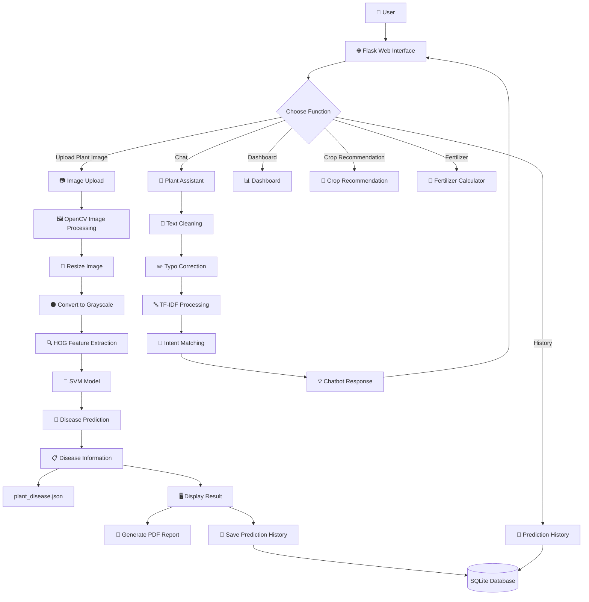
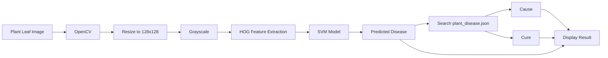
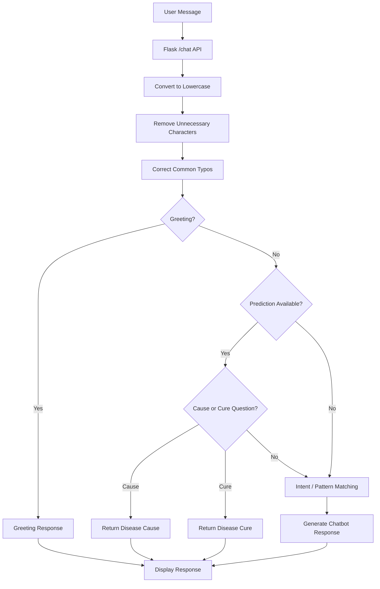
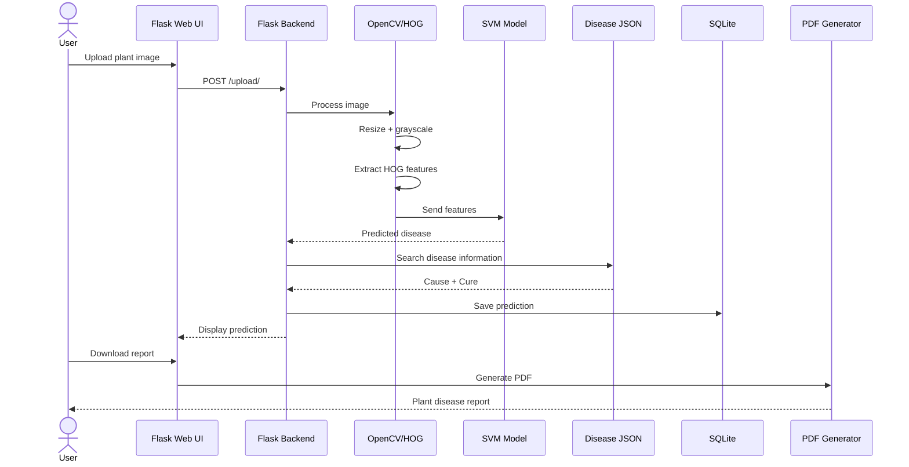

# 🌱 Plant Disease Prediction and Chatbot Assistant using SVM

An AI-powered web application that detects plant diseases from leaf images using a **Support Vector Machine (SVM)** model and provides disease information, causes, recommended treatments, and an interactive plant-health chatbot.

---

## 📌 Project Overview

The **Plant Disease Prediction and Chatbot Assistant** is designed to help users identify possible plant diseases by uploading an image of a plant leaf.

The system:

* 📷 Accepts plant/leaf images from users
* 🔍 Extracts visual features using **HOG (Histogram of Oriented Gradients)**
* 🤖 Uses a trained **SVM machine-learning model** for disease prediction
* 🌿 Displays the predicted disease
* 📋 Provides disease cause and recommended cure
* 💬 Provides an interactive plant-health chatbot
* 📄 Generates a downloadable disease prediction report
* 📜 Stores previous predictions in a local history database
* 🌱 Provides crop recommendation and fertilizer-related features

---

# ✨ Features

### 🔬 Plant Disease Detection

Users can upload a plant image through the web interface.

The image is processed using:

```text
Image
  ↓
Resize
  ↓
Grayscale Conversion
  ↓
HOG Feature Extraction
  ↓
SVM Model
  ↓
Disease Prediction
```

### 🤖 AI-Based Prediction

The project uses:

* **HOG** for image feature extraction
* **SVM** for classification
* A trained model stored as `svm_model.pkl`

### 🌿 Disease Information

After prediction, the application displays:

* Disease name
* Cause
* Recommended cure/treatment
* Prediction confidence

Disease information is maintained in:

```text
plant_disease.json
```

### 💬 Plant Assistant Chatbot

The application contains a chatbot that can respond to plant-related questions such as:

```text
What is black spot?
What causes powdery mildew?
What is the cure?
What caused this disease?
My leaves are turning yellow
```

The chatbot uses:

* `intents.json`
* TF-IDF vectorization
* Pattern matching
* Disease information
* Current prediction context

### 📄 PDF Report Generation

Users can download a report containing:

* Detected disease
* Confidence
* Cause
* Recommended treatment
* Uploaded image
* Report generation date

### 📜 Prediction History

Previous predictions are stored using **SQLite**.

The history contains:

* Disease
* Cure
* Uploaded image
* Date/time

---

# 🛠️ Tech Stack

| Category           | Technology                       |
| ------------------ | -------------------------------- |
| Frontend           | HTML, CSS, Bootstrap, JavaScript |
| Backend            | Python, Flask                    |
| Machine Learning   | Scikit-learn                     |
| Image Processing   | OpenCV                           |
| Feature Extraction | HOG / scikit-image               |
| ML Algorithm       | Support Vector Machine (SVM)     |
| Chatbot            | TF-IDF + Intent Matching         |
| Database           | SQLite                           |
| Reports            | ReportLab                        |
| Model Storage      | Joblib                           |
| Data Format        | JSON                             |

---

# 🧠 System Architecture



---

# 🔄 Disease Prediction Flow



---

# 💬 Chatbot Flow



---

# 📂 Project Structure

```text
plant disease prediction advanced/
│
├── app.py
├── svm_model.pkl
├── plant_disease.json
├── history.db
├── report.pdf
│
├── chatbot/
│   └── intents.json
│
├── templates/
│   ├── home.html
│   ├── dashboard.html
│   ├── crop.html
│   ├── fertilizer.html
│   └── history.html
│
├── static/
│   ├── css/
│   │   ├── bootstrap.min.css
│   │   └── style.css
│   │
│   ├── images/
│   │   └── ...
│   │
│   ├── sounds/
│   │   └── beep.mp3
│   │
│   └── uploadimages/
│       └── ...
│
└── README.md
```

---

# ⚙️ How the System Works

## 1. Image Upload

The user selects a plant image through the web interface.

## 2. Image Preprocessing

OpenCV loads the image and resizes it to:

```text
128 × 128 pixels
```

The image is then converted to grayscale.

## 3. Feature Extraction

The system extracts HOG features from the processed image.

HOG captures important visual structures such as:

* Edges
* Shapes
* Textures
* Leaf patterns

## 4. Disease Classification

The extracted features are passed to the trained SVM model.

```text
HOG Features
      ↓
SVM
      ↓
Predicted Disease
```

## 5. Disease Information

The predicted disease is matched against `plant_disease.json`.

The application retrieves:

```text
Disease
Cause
Cure
```

## 6. Result

The result is displayed on the web page along with the uploaded image.

---

# 💬 Example Chatbot Questions

The chatbot can handle questions such as:

```text
What is black spot?
What causes black spot?
What is the cure?
What is powdery mildew?
What causes rust disease?
My leaves are turning yellow
My plant is wilting
What is leaf blight?
What is bacterial spot?
What should I do?
```

---

# 📄 Report Generation

The application provides a **Download Report** option.

The generated PDF contains:

```text
Plant Disease Prediction Report

Detected Disease
Confidence

Cause

Recommended Treatment

Analyzed Image

Generated Date
```

---

# 🗄️ Database

SQLite is used to maintain prediction history.

### History Table

```text
id
disease
cure
image
time
```

Every successful image prediction can be stored for later viewing.

---

# 🚀 Installation

## 1. Clone the Repository

```bash
git clone https://github.com/Chintana-Projects/Plant-Disease-Prediction-and-Chatbot-Assistant-using-SVM.git
```

## 2. Navigate to the Project

```bash
cd "plant disease prediction advanced"
```

## 3. Create Virtual Environment

```bash
python -m venv .venv
```

## 4. Activate Virtual Environment

### Windows

```bash
.venv\Scripts\activate
```

## 5. Install Dependencies

```bash
pip install flask numpy opencv-python scikit-image scikit-learn joblib reportlab
```

## 6. Run the Application

```bash
python app.py
```

The application will normally be available at:

```text
http://127.0.0.1:5000
```

---

# 🖥️ Application Workflow



---

# 🎯 Project Objectives

The main objectives of this project are:

1. Develop an accessible plant disease detection system.
2. Apply machine learning to plant image classification.
3. Extract meaningful visual features from plant images.
4. Provide useful disease information to users.
5. Provide an interactive plant-health assistant.
6. Maintain prediction history.
7. Generate downloadable disease reports.
8. Provide a simple web-based interface for users.

---

# 🔮 Future Improvements

Possible future improvements include:

* 🧠 CNN/Deep Learning-based image classification
* 🌿 Training with real-world plant images
* 📷 Better handling of complex backgrounds
* 🔍 Leaf segmentation/background removal
* 📊 Improved confidence estimation
* 🌱 Support for more plant species
* 📱 Mobile-friendly interface
* ☁️ Cloud deployment
* 🌍 Multilingual chatbot
* 📈 Model performance dashboard
* 🖼️ Real-world Google-image testing dataset

---

# 🏆 Academic Showcase

This project was selected for participation in the **NASSCOM Future Forge 2026 – Academic Showcase** at Taj Yeshwantpur, Bengaluru.

The project demonstrates the application of:

```text
Machine Learning
        +
Computer Vision
        +
Natural Language Processing
        +
Web Development
        +
Database Management
```

to develop an accessible plant-health assistance system.

---

# 👩‍💻 Developer

**Chintana B**

AIML Student
Sapthagiri NPS University
Expected Graduation: 2028

### Skills

```text
Python
Machine Learning
SQL
HTML
CSS
JavaScript
Computer Vision
```

### GitHub

**Chintana-Projects**

---

# 📜 License

This project is developed for academic and educational purposes.

---

## 🌱 Project Summary

> **Plant Disease Prediction and Chatbot Assistant** combines machine learning, computer vision, and a conversational assistant to help users identify plant diseases and understand possible causes and treatments through a simple web interface.
